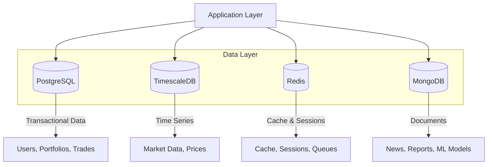
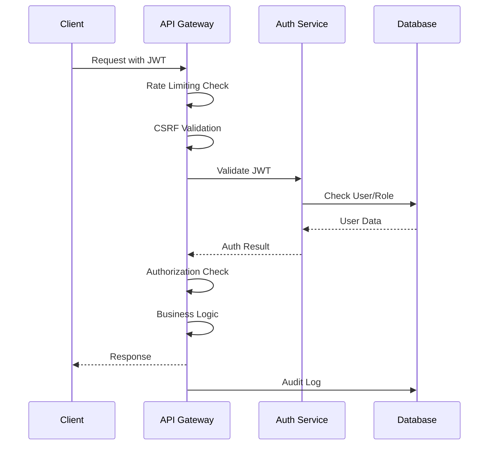
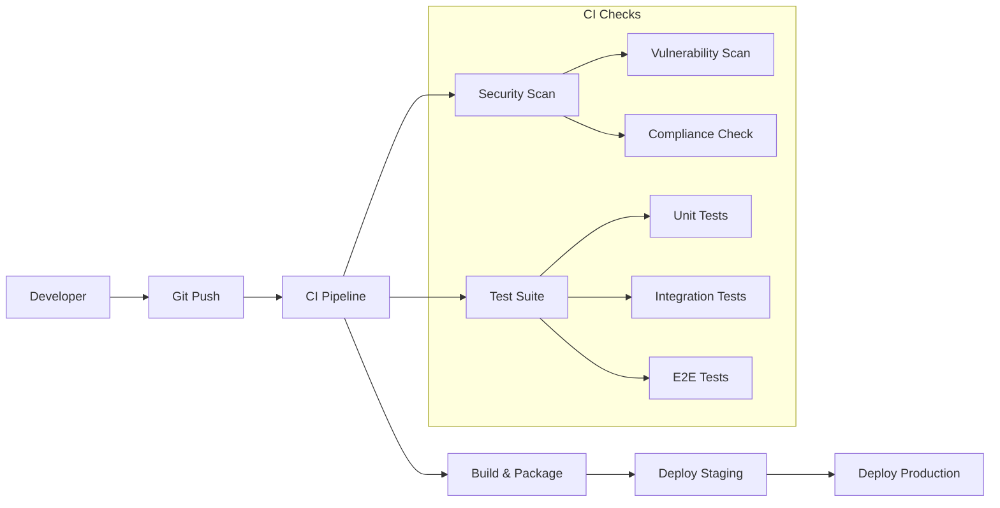

# 🏗️ System Architecture

## Overview

The Stratford AI Wealth Engine is built using a layered architecture pattern with clear separation of concerns, following Domain-Driven Design (DDD) principles. The system is designed for enterprise-scale financial operations with comprehensive security, compliance, and performance requirements.

## Architectural Principles

### 1. **Layered Architecture**
- **Presentation Layer**: Next.js React frontend with TypeScript
- **API Layer**: Next.js API routes with middleware pipeline
- **Business Logic Layer**: Domain services and aggregates
- **Data Access Layer**: Multi-database strategy with ORM abstraction
- **Infrastructure Layer**: External services and system utilities

### 2. **Domain-Driven Design (DDD)**
- **Bounded Contexts**: Trading, Compliance, User Management, Analytics
- **Aggregates**: Portfolio, Trade, User, Strategy, KycRecord
- **Value Objects**: Money, Symbol, Quantity, Price
- **Domain Services**: Risk calculation, performance analysis
- **Repository Pattern**: Data access abstraction

### 3. **Security-First Design**
- **Zero Trust Architecture**: Every request is authenticated and authorized
- **Defense in Depth**: Multiple security layers (network, application, data)
- **Principle of Least Privilege**: Minimal required permissions
- **Encryption Everywhere**: Data encrypted at rest and in transit

## System Components

### Frontend Layer

```typescript
// Component hierarchy
App
├── AuthProvider (NextAuth.js)
├── QueryProvider (React Query)
├── ThemeProvider (Tailwind CSS)
└── Pages
    ├── Dashboard
    │   ├── PortfolioOverview
    │   ├── TradingInterface
    │   └── PerformanceMetrics
    ├── Trading
    │   ├── OrderEntry
    │   ├── PositionManagement
    │   └── StrategyRunner
    ├── Compliance
    │   ├── KYCForm
    │   ├── AMLDashboard
    │   └── AuditTrail
    └── Settings
        ├── UserProfile
        ├── SecuritySettings
        └── APIKeys
```

### API Layer

```typescript
// Middleware pipeline
Request
├── CORS Headers
├── Security Headers
├── Rate Limiting
├── CSRF Protection
├── Authentication
├── Authorization
├── Input Validation
├── Business Logic
├── Response Formatting
└── Audit Logging
```

### Business Logic Layer

```typescript
// Domain structure
src/domain/
├── trading/
│   ├── portfolio-aggregate.ts
│   ├── trade-entity.ts
│   ├── position-value-object.ts
│   └── trading-service.ts
├── compliance/
│   ├── kyc-aggregate.ts
│   ├── aml-service.ts
│   └── audit-service.ts
├── user/
│   ├── user-aggregate.ts
│   └── user-service.ts
└── shared/
    ├── money-value-object.ts
    ├── date-range-value-object.ts
    └── domain-events.ts
```

## Data Architecture

### Multi-Database Strategy



#### Database Responsibilities

| Database | Use Case | Data Types | Performance Characteristics |
|----------|----------|------------|----------------------------|
| **PostgreSQL** | Transactional data | Users, Portfolios, Trades, KYC | ACID compliance, strong consistency |
| **TimescaleDB** | Time-series data | Market prices, indicators | Automatic compression, fast aggregations |
| **Redis** | Cache & real-time | Sessions, cache, pub/sub | Sub-millisecond latency, high throughput |
| **MongoDB** | Document storage | News, ML models, reports | Flexible schema, horizontal scaling |

### Data Flow Patterns

#### 1. **CQRS (Command Query Responsibility Segregation)**
```typescript
// Commands (Write side)
interface CreateTradeCommand {
  portfolioId: string
  symbol: string
  quantity: number
  price: number
  side: 'BUY' | 'SELL'
}

// Queries (Read side)
interface PortfolioQuery {
  userId: string
  includePositions: boolean
  includePerformance: boolean
}
```

#### 2. **Event Sourcing for Audit Trail**
```typescript
interface DomainEvent {
  eventId: string
  aggregateId: string
  eventType: string
  eventData: any
  timestamp: Date
  userId: string
}

// Examples
TradeExecutedEvent
PositionUpdatedEvent
KYCStatusChangedEvent
ComplianceAlertTriggeredEvent
```

## Security Architecture

### Authentication & Authorization Flow



### Encryption Strategy

#### 1. **Data at Rest**
- **Database encryption**: PostgreSQL TDE (Transparent Data Encryption)
- **Field-level encryption**: AES-256-GCM for PII/financial data
- **Key management**: Hardware Security Module (HSM) or AWS KMS

#### 2. **Data in Transit**
- **TLS 1.3**: All external communications
- **mTLS**: Internal service-to-service communication
- **Certificate pinning**: Mobile applications

#### 3. **Application-Level Encryption**
```typescript
// Field-level encryption for sensitive data
class EncryptedField {
  constructor(
    private value: string,
    private encryptionKey: string
  ) {}

  encrypt(): EncryptedData {
    return fieldEncryption.encrypt(this.value, this.encryptionKey)
  }

  decrypt(encryptedData: EncryptedData): string {
    return fieldEncryption.decrypt(encryptedData, this.encryptionKey)
  }
}
```

## Performance Architecture

### Caching Strategy

```typescript
// Multi-layer caching
interface CacheStrategy {
  // L1: Application memory cache
  memory: LRUCache<string, any>

  // L2: Redis distributed cache
  redis: RedisCache

  // L3: Database query optimization
  database: QueryOptimizer
}

// Cache patterns
class MarketDataCache {
  async getPrice(symbol: string): Promise<Price> {
    // 1. Check memory cache (fastest)
    let price = this.memoryCache.get(`price:${symbol}`)
    if (price) return price

    // 2. Check Redis cache (fast)
    price = await this.redisCache.get(`price:${symbol}`)
    if (price) {
      this.memoryCache.set(`price:${symbol}`, price)
      return price
    }

    // 3. Query database (slower)
    price = await this.database.getCurrentPrice(symbol)

    // Cache for future requests
    await this.redisCache.set(`price:${symbol}`, price, 60)
    this.memoryCache.set(`price:${symbol}`, price)

    return price
  }
}
```

### Real-Time Data Processing

```typescript
// WebSocket connections for real-time updates
class RealTimeService {
  private connections = new Map<string, WebSocket>()

  async subscribeToMarketData(userId: string, symbols: string[]) {
    const ws = this.connections.get(userId)

    // Subscribe to Redis pub/sub
    await this.redis.subscribe(
      symbols.map(s => `market:${s}`),
      (channel, data) => {
        ws?.send(JSON.stringify({
          type: 'MARKET_UPDATE',
          symbol: channel.replace('market:', ''),
          data: JSON.parse(data)
        }))
      }
    )
  }
}
```

## Scalability Patterns

### Horizontal Scaling

#### 1. **Load Balancing**
```yaml
# nginx.conf
upstream stratford_api {
    least_conn;
    server api1.stratford.ai:3000;
    server api2.stratford.ai:3000;
    server api3.stratford.ai:3000;
}
```

#### 2. **Database Sharding**
```typescript
// User-based sharding strategy
class ShardingService {
  getShardForUser(userId: string): string {
    const hash = crypto.createHash('sha256').update(userId).digest('hex')
    const shardIndex = parseInt(hash.substring(0, 8), 16) % this.shardCount
    return `shard_${shardIndex}`
  }
}
```

#### 3. **Microservices Architecture**
```typescript
// Service boundaries
interface Services {
  userService: UserManagementService
  tradingService: TradingExecutionService
  complianceService: ComplianceVerificationService
  analyticsService: PerformanceAnalyticsService
  marketDataService: MarketDataIngestionService
  notificationService: NotificationDeliveryService
}
```

## Monitoring & Observability

### Application Performance Monitoring

```typescript
// Custom metrics collection
class MetricsCollector {
  trackTradeExecution(trade: Trade, executionTime: number) {
    this.histogram('trade_execution_time', executionTime, {
      symbol: trade.symbol,
      side: trade.side,
      amount: this.bucketizeAmount(trade.totalValue)
    })
  }

  trackAPIEndpoint(endpoint: string, method: string, statusCode: number, responseTime: number) {
    this.counter('api_requests_total', 1, {
      endpoint,
      method,
      status: statusCode.toString()
    })

    this.histogram('api_response_time', responseTime, {
      endpoint,
      method
    })
  }
}
```

### Health Checks

```typescript
// Comprehensive health monitoring
interface HealthCheck {
  database: DatabaseHealthCheck
  redis: RedisHealthCheck
  externalAPIs: ExternalAPIHealthCheck
  background_jobs: BackgroundJobHealthCheck
}

class HealthMonitor {
  async checkSystemHealth(): Promise<SystemHealth> {
    const checks = await Promise.allSettled([
      this.checkDatabase(),
      this.checkRedis(),
      this.checkExternalAPIs(),
      this.checkBackgroundJobs()
    ])

    return {
      status: this.calculateOverallStatus(checks),
      timestamp: new Date(),
      checks: this.formatCheckResults(checks)
    }
  }
}
```

## Deployment Architecture

### Infrastructure as Code

```yaml
# docker-compose.production.yml
version: '3.8'
services:
  app:
    image: stratford-ai:latest
    replicas: 3
    environment:
      - NODE_ENV=production
    depends_on:
      - postgres
      - redis
      - timescaledb

  postgres:
    image: postgres:15
    environment:
      - POSTGRES_DB=stratford_prod
    volumes:
      - postgres_data:/var/lib/postgresql/data

  redis:
    image: redis:7
    volumes:
      - redis_data:/data

  timescaledb:
    image: timescale/timescaledb:latest-pg15
    volumes:
      - timescale_data:/var/lib/postgresql/data
```

### CI/CD Pipeline Architecture



## Error Handling & Resilience

### Circuit Breaker Pattern

```typescript
class CircuitBreaker {
  private state: 'CLOSED' | 'OPEN' | 'HALF_OPEN' = 'CLOSED'
  private failureCount = 0
  private lastFailureTime = 0

  async execute<T>(operation: () => Promise<T>): Promise<T> {
    if (this.state === 'OPEN') {
      if (Date.now() - this.lastFailureTime > this.timeout) {
        this.state = 'HALF_OPEN'
      } else {
        throw new Error('Circuit breaker is OPEN')
      }
    }

    try {
      const result = await operation()
      this.onSuccess()
      return result
    } catch (error) {
      this.onFailure()
      throw error
    }
  }
}
```

### Retry Logic with Exponential Backoff

```typescript
class RetryService {
  async withRetry<T>(
    operation: () => Promise<T>,
    options: RetryOptions = {}
  ): Promise<T> {
    const { maxRetries = 3, baseDelay = 1000, maxDelay = 10000 } = options

    for (let attempt = 0; attempt <= maxRetries; attempt++) {
      try {
        return await operation()
      } catch (error) {
        if (attempt === maxRetries || !this.isRetryableError(error)) {
          throw error
        }

        const delay = Math.min(
          baseDelay * Math.pow(2, attempt),
          maxDelay
        )

        await this.sleep(delay)
      }
    }

    throw new Error('Unexpected retry loop exit')
  }
}
```

This architecture provides a solid foundation for building enterprise-grade financial applications with proper separation of concerns, security, scalability, and maintainability.