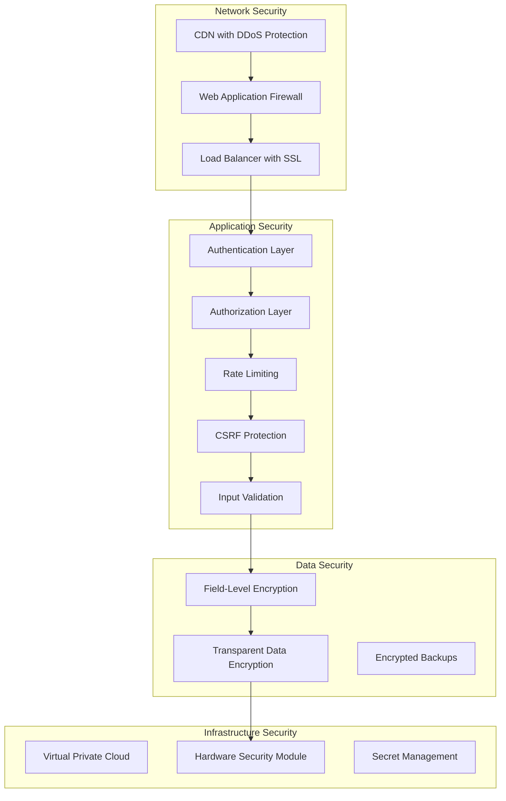

# 🔒 Security Documentation

## Security Overview

The Stratford AI Wealth Engine implements enterprise-grade security measures to protect sensitive financial data and ensure regulatory compliance. Our security model follows the principle of "defense in depth" with multiple layers of protection.

## Security Architecture

### Multi-Layer Security Model



## Authentication & Authorization

### Authentication Methods

#### 1. **Multi-Factor Authentication (MFA)**

```typescript
// MFA implementation
interface MFAConfig {
  enabled: boolean
  methods: ('TOTP' | 'SMS' | 'EMAIL' | 'HARDWARE_KEY')[]
  gracePeriod: number // hours
  backupCodes: boolean
}

class MFAService {
  async enableMFA(userId: string, method: string, secret: string): Promise<void> {
    // Validate TOTP token before enabling
    const isValid = await this.validateTOTP(secret, token)
    if (!isValid) throw new Error('Invalid MFA token')

    await prisma.user.update({
      where: { id: userId },
      data: {
        twoFactorEnabled: true,
        twoFactorSecret: await this.encryptMFASecret(secret, userId)
      }
    })

    // Log MFA enablement for audit
    await this.auditLogger.log({
      userId,
      action: 'MFA_ENABLED',
      method,
      timestamp: new Date()
    })
  }
}
```

#### 2. **JWT Token Management**

```typescript
// Secure JWT configuration
const jwtConfig = {
  secret: process.env.NEXTAUTH_SECRET,
  algorithm: 'HS256',
  expiresIn: '1h',
  issuer: 'stratford-ai',
  audience: 'stratford-api',
  clockTolerance: 30 // seconds
}

class JWTService {
  generateToken(payload: TokenPayload): string {
    return jwt.sign(
      {
        sub: payload.userId,
        role: payload.role,
        permissions: payload.permissions,
        sessionId: payload.sessionId,
        iat: Math.floor(Date.now() / 1000),
        jti: crypto.randomUUID() // Unique token ID for revocation
      },
      jwtConfig.secret,
      {
        algorithm: jwtConfig.algorithm,
        expiresIn: jwtConfig.expiresIn,
        issuer: jwtConfig.issuer,
        audience: jwtConfig.audience
      }
    )
  }

  async validateToken(token: string): Promise<TokenPayload> {
    try {
      const decoded = jwt.verify(token, jwtConfig.secret, {
        algorithms: [jwtConfig.algorithm],
        issuer: jwtConfig.issuer,
        audience: jwtConfig.audience,
        clockTolerance: jwtConfig.clockTolerance
      }) as jwt.JwtPayload

      // Check if token is revoked
      const isRevoked = await this.redis.sismember('revoked_tokens', decoded.jti)
      if (isRevoked) throw new Error('Token revoked')

      return {
        userId: decoded.sub,
        role: decoded.role,
        permissions: decoded.permissions,
        sessionId: decoded.sessionId
      }
    } catch (error) {
      throw new AuthenticationError('Invalid token')
    }
  }
}
```

### Role-Based Access Control (RBAC)

```typescript
// Permission system
enum Permission {
  // User permissions
  READ_PROFILE = 'user:read_profile',
  UPDATE_PROFILE = 'user:update_profile',

  // Portfolio permissions
  READ_PORTFOLIO = 'portfolio:read',
  CREATE_PORTFOLIO = 'portfolio:create',
  UPDATE_PORTFOLIO = 'portfolio:update',
  DELETE_PORTFOLIO = 'portfolio:delete',

  // Trading permissions
  VIEW_POSITIONS = 'trading:view_positions',
  EXECUTE_TRADES = 'trading:execute',
  CANCEL_ORDERS = 'trading:cancel_orders',

  // Admin permissions
  MANAGE_USERS = 'admin:manage_users',
  VIEW_AUDIT_LOGS = 'admin:view_audit_logs',
  MANAGE_SYSTEM = 'admin:manage_system',

  // Compliance permissions
  REVIEW_KYC = 'compliance:review_kyc',
  INVESTIGATE_AML = 'compliance:investigate_aml',
  GENERATE_REPORTS = 'compliance:generate_reports'
}

enum Role {
  USER = 'USER',
  TRADER = 'TRADER',
  PORTFOLIO_MANAGER = 'PORTFOLIO_MANAGER',
  COMPLIANCE_OFFICER = 'COMPLIANCE_OFFICER',
  ADMIN = 'ADMIN',
  SUPER_ADMIN = 'SUPER_ADMIN'
}

const rolePermissions: Record<Role, Permission[]> = {
  [Role.USER]: [
    Permission.READ_PROFILE,
    Permission.UPDATE_PROFILE,
    Permission.READ_PORTFOLIO,
    Permission.VIEW_POSITIONS
  ],
  [Role.TRADER]: [
    ...rolePermissions[Role.USER],
    Permission.CREATE_PORTFOLIO,
    Permission.EXECUTE_TRADES,
    Permission.CANCEL_ORDERS
  ],
  [Role.COMPLIANCE_OFFICER]: [
    Permission.REVIEW_KYC,
    Permission.INVESTIGATE_AML,
    Permission.GENERATE_REPORTS,
    Permission.VIEW_AUDIT_LOGS
  ],
  [Role.ADMIN]: [
    ...rolePermissions[Role.TRADER],
    ...rolePermissions[Role.COMPLIANCE_OFFICER],
    Permission.MANAGE_USERS,
    Permission.MANAGE_SYSTEM
  ]
}

// Authorization middleware
function requirePermissions(permissions: Permission[]) {
  return (req: AuthenticatedRequest, res: NextApiResponse, next: NextFunction) => {
    const userPermissions = rolePermissions[req.user.role] || []
    const hasPermission = permissions.every(permission =>
      userPermissions.includes(permission)
    )

    if (!hasPermission) {
      return res.status(403).json({
        error: 'Forbidden',
        message: 'Insufficient permissions',
        required: permissions
      })
    }

    next()
  }
}
```

## Data Protection

### Field-Level Encryption

```typescript
// Encryption service for sensitive data
class FieldEncryption {
  private readonly algorithm = 'aes-256-gcm'
  private readonly keyDerivationIterations = 100000

  async encryptField(
    plaintext: string,
    contextKey: string,
    userId: string
  ): Promise<EncryptedField> {
    // Generate unique salt for each encryption
    const salt = crypto.randomBytes(32)
    const iv = crypto.randomBytes(16)

    // Derive encryption key using PBKDF2
    const key = crypto.pbkdf2Sync(
      this.masterKey + contextKey + userId,
      salt,
      this.keyDerivationIterations,
      32,
      'sha256'
    )

    // Encrypt the data
    const cipher = crypto.createCipher(this.algorithm, key)
    cipher.setAAD(Buffer.from(contextKey + userId))

    let encrypted = cipher.update(plaintext, 'utf8', 'hex')
    encrypted += cipher.final('hex')

    const authTag = cipher.getAuthTag()

    return {
      encryptedData: encrypted,
      salt: salt.toString('hex'),
      iv: iv.toString('hex'),
      authTag: authTag.toString('hex'),
      algorithm: this.algorithm
    }
  }

  async decryptField(
    encryptedField: EncryptedField,
    contextKey: string,
    userId: string
  ): Promise<string> {
    const salt = Buffer.from(encryptedField.salt, 'hex')
    const iv = Buffer.from(encryptedField.iv, 'hex')
    const authTag = Buffer.from(encryptedField.authTag, 'hex')

    // Derive the same key
    const key = crypto.pbkdf2Sync(
      this.masterKey + contextKey + userId,
      salt,
      this.keyDerivationIterations,
      32,
      'sha256'
    )

    // Decrypt the data
    const decipher = crypto.createDecipher(encryptedField.algorithm, key)
    decipher.setAuthTag(authTag)
    decipher.setAAD(Buffer.from(contextKey + userId))

    let decrypted = decipher.update(encryptedField.encryptedData, 'hex', 'utf8')
    decrypted += decipher.final('utf8')

    return decrypted
  }
}

// Prisma middleware for automatic encryption/decryption
const encryptionMiddleware: Prisma.Middleware = async (params, next) => {
  const encryptedFields = {
    User: ['ssn', 'taxId'],
    KycRecord: ['ssn', 'documentNumber'],
    BankAccount: ['accountNumber', 'routingNumber']
  }

  if (params.action === 'create' || params.action === 'update') {
    const modelFields = encryptedFields[params.model]
    if (modelFields) {
      for (const field of modelFields) {
        if (params.args.data[field]) {
          params.args.data[field] = await fieldEncryption.encryptField(
            params.args.data[field],
            `${params.model}:${field}`,
            params.args.data.userId
          )
        }
      }
    }
  }

  const result = await next(params)

  // Decrypt on read
  if (params.action === 'findUnique' || params.action === 'findMany') {
    // Decryption logic here
  }

  return result
}
```

### Database Security

#### 1. **Connection Security**

```typescript
// Secure database configuration
const databaseConfig = {
  url: process.env.DATABASE_URL,
  ssl: {
    rejectUnauthorized: true,
    ca: fs.readFileSync('/path/to/ca-cert.pem'),
    cert: fs.readFileSync('/path/to/client-cert.pem'),
    key: fs.readFileSync('/path/to/client-key.pem')
  },
  pool: {
    min: 5,
    max: 20,
    acquireTimeoutMillis: 30000,
    createTimeoutMillis: 30000,
    destroyTimeoutMillis: 5000,
    idleTimeoutMillis: 30000,
    reapIntervalMillis: 1000,
    createRetryIntervalMillis: 200
  },
  migrations: {
    tableName: 'schema_migrations',
    directory: './migrations'
  }
}
```

#### 2. **Query Security**

```typescript
// Parameterized queries to prevent SQL injection
class SecureQueryBuilder {
  private readonly allowedOperators = ['=', '!=', '<', '>', '<=', '>=', 'IN', 'NOT IN']
  private readonly allowedFields = new Set(['id', 'email', 'createdAt', 'updatedAt'])

  buildWhereClause(filters: Record<string, any>): Prisma.Sql {
    const conditions: Prisma.Sql[] = []

    for (const [field, value] of Object.entries(filters)) {
      // Validate field names to prevent injection
      if (!this.allowedFields.has(field)) {
        throw new Error(`Invalid field: ${field}`)
      }

      // Use parameterized queries
      conditions.push(Prisma.sql`${Prisma.raw(field)} = ${value}`)
    }

    return Prisma.join(conditions, ' AND ')
  }
}
```

## Network Security

### Rate Limiting

```typescript
// Advanced rate limiting with multiple strategies
class RateLimiter {
  // Token bucket algorithm for burst protection
  async tokenBucket(
    key: string,
    capacity: number,
    refillRate: number,
    tokens: number = 1
  ): Promise<boolean> {
    const now = Date.now()
    const bucket = await this.redis.hmget(key, 'tokens', 'lastRefill')

    let availableTokens = parseInt(bucket[0] || capacity.toString())
    const lastRefill = parseInt(bucket[1] || now.toString())

    // Refill tokens based on time elapsed
    const timeElapsed = now - lastRefill
    const tokensToAdd = Math.floor(timeElapsed * refillRate / 1000)
    availableTokens = Math.min(capacity, availableTokens + tokensToAdd)

    if (availableTokens >= tokens) {
      availableTokens -= tokens
      await this.redis.hmset(key, 'tokens', availableTokens, 'lastRefill', now)
      await this.redis.expire(key, 3600) // 1 hour TTL
      return true
    }

    return false
  }

  // Sliding window log for precise rate limiting
  async slidingWindowLog(
    key: string,
    limit: number,
    windowMs: number
  ): Promise<boolean> {
    const now = Date.now()
    const windowStart = now - windowMs

    // Remove old entries and count current requests
    await this.redis.zremrangebyscore(key, 0, windowStart)
    const currentCount = await this.redis.zcard(key)

    if (currentCount < limit) {
      // Add current request
      await this.redis.zadd(key, now, `${now}-${Math.random()}`)
      await this.redis.expire(key, Math.ceil(windowMs / 1000))
      return true
    }

    return false
  }

  // Adaptive rate limiting based on system load
  async adaptiveRateLimit(
    key: string,
    baseLimit: number,
    systemLoad: number
  ): Promise<boolean> {
    // Reduce limit based on system load
    const adjustedLimit = Math.floor(baseLimit * (1 - systemLoad))
    return this.slidingWindowLog(key, adjustedLimit, 60000) // 1 minute window
  }
}
```

### CSRF Protection

```typescript
// CSRF token generation and validation
class CSRFProtection {
  generateToken(sessionId: string): string {
    const timestamp = Date.now().toString()
    const randomBytes = crypto.randomBytes(16).toString('hex')
    const data = `${sessionId}:${timestamp}:${randomBytes}`

    const hmac = crypto.createHmac('sha256', this.csrfSecret)
    hmac.update(data)
    const signature = hmac.digest('hex')

    return Buffer.from(`${data}:${signature}`).toString('base64')
  }

  validateToken(token: string, sessionId: string): boolean {
    try {
      const decoded = Buffer.from(token, 'base64').toString()
      const [receivedSessionId, timestamp, randomBytes, signature] = decoded.split(':')

      // Validate session ID
      if (receivedSessionId !== sessionId) return false

      // Validate timestamp (token expires after 1 hour)
      const tokenAge = Date.now() - parseInt(timestamp)
      if (tokenAge > 3600000) return false

      // Validate signature
      const data = `${receivedSessionId}:${timestamp}:${randomBytes}`
      const hmac = crypto.createHmac('sha256', this.csrfSecret)
      hmac.update(data)
      const expectedSignature = hmac.digest('hex')

      return crypto.timingSafeEqual(
        Buffer.from(signature, 'hex'),
        Buffer.from(expectedSignature, 'hex')
      )
    } catch (error) {
      return false
    }
  }
}
```

## Security Headers

```typescript
// Comprehensive security headers
const securityHeaders = {
  // Prevent XSS attacks
  'X-XSS-Protection': '1; mode=block',

  // Prevent content type sniffing
  'X-Content-Type-Options': 'nosniff',

  // Prevent clickjacking
  'X-Frame-Options': 'DENY',

  // Referrer policy
  'Referrer-Policy': 'strict-origin-when-cross-origin',

  // Content Security Policy
  'Content-Security-Policy': [
    "default-src 'self'",
    "script-src 'self' 'unsafe-inline' 'unsafe-eval'",
    "style-src 'self' 'unsafe-inline'",
    "img-src 'self' data: https:",
    "font-src 'self' data:",
    "connect-src 'self' https://api.stratford.ai wss:",
    "frame-ancestors 'none'",
    "base-uri 'self'",
    "form-action 'self'"
  ].join('; '),

  // Permissions Policy
  'Permissions-Policy': [
    'camera=()',
    'microphone=()',
    'geolocation=()',
    'payment=()',
    'usb=()',
    'magnetometer=()',
    'gyroscope=()',
    'accelerometer=()'
  ].join(', '),

  // HTTPS enforcement
  'Strict-Transport-Security': 'max-age=31536000; includeSubDomains; preload'
}
```

## Vulnerability Management

### Dependency Scanning

```yaml
# .github/workflows/security.yml
name: Security Scan

on: [push, pull_request]

jobs:
  dependency-scan:
    runs-on: ubuntu-latest
    steps:
      - uses: actions/checkout@v4

      - name: Run Snyk to check for vulnerabilities
        uses: snyk/actions/node@master
        env:
          SNYK_TOKEN: ${{ secrets.SNYK_TOKEN }}

      - name: Run npm audit
        run: |
          npm audit --audit-level=critical
          npm audit --audit-level=high --dry-run

      - name: OWASP Dependency Check
        uses: dependency-check/Dependency-Check_Action@main
        with:
          project: 'Stratford AI'
          path: '.'
          format: 'JSON'
```

### Code Scanning

```typescript
// Security linting rules
const securityLintRules = {
  // Prevent dangerous functions
  'no-eval': 'error',
  'no-implied-eval': 'error',
  'no-new-func': 'error',

  // Prevent prototype pollution
  'security/detect-object-injection': 'error',

  // Prevent regex DOS
  'security/detect-unsafe-regex': 'error',

  // Prevent path traversal
  'security/detect-non-literal-fs-filename': 'error',

  // Prevent command injection
  'security/detect-child-process': 'error',

  // Prevent SQL injection
  'security/detect-non-literal-require': 'error'
}
```

## Incident Response

### Security Monitoring

```typescript
// Security event monitoring
class SecurityMonitor {
  async detectSuspiciousActivity(event: SecurityEvent): Promise<void> {
    const alerts: SecurityAlert[] = []

    // Multiple failed login attempts
    if (event.type === 'LOGIN_FAILED') {
      const failedAttempts = await this.getFailedLoginCount(
        event.userId,
        event.ipAddress,
        15 * 60 * 1000 // 15 minutes
      )

      if (failedAttempts >= 5) {
        alerts.push({
          type: 'BRUTE_FORCE_ATTACK',
          severity: 'HIGH',
          userId: event.userId,
          ipAddress: event.ipAddress,
          timestamp: new Date()
        })
      }
    }

    // Unusual trading activity
    if (event.type === 'TRADE_EXECUTED') {
      const trade = event.data as Trade
      const userProfile = await this.getUserTradingProfile(trade.userId)

      if (trade.totalValue > userProfile.averageTradeSize * 10) {
        alerts.push({
          type: 'UNUSUAL_TRADE_SIZE',
          severity: 'MEDIUM',
          userId: trade.userId,
          metadata: {
            tradeValue: trade.totalValue,
            averageSize: userProfile.averageTradeSize
          }
        })
      }
    }

    // Geographic anomaly
    if (event.type === 'LOGIN_SUCCESS') {
      const lastKnownLocation = await this.getLastKnownLocation(event.userId)
      const currentLocation = await this.getLocationFromIP(event.ipAddress)

      if (this.calculateDistance(lastKnownLocation, currentLocation) > 1000) {
        alerts.push({
          type: 'GEOGRAPHIC_ANOMALY',
          severity: 'HIGH',
          userId: event.userId,
          metadata: {
            lastLocation: lastKnownLocation,
            currentLocation: currentLocation
          }
        })
      }
    }

    // Process alerts
    for (const alert of alerts) {
      await this.processSecurityAlert(alert)
    }
  }

  private async processSecurityAlert(alert: SecurityAlert): Promise<void> {
    // Log to security information and event management (SIEM)
    await this.siem.logAlert(alert)

    // Notify security team
    if (alert.severity === 'HIGH' || alert.severity === 'CRITICAL') {
      await this.notificationService.sendSecurityAlert(alert)
    }

    // Automatic response actions
    switch (alert.type) {
      case 'BRUTE_FORCE_ATTACK':
        await this.temporarilyBlockIP(alert.ipAddress, 3600000) // 1 hour
        break

      case 'GEOGRAPHIC_ANOMALY':
        await this.requireAdditionalVerification(alert.userId)
        break

      case 'UNUSUAL_TRADE_SIZE':
        await this.flagTradeForReview(alert.metadata.tradeId)
        break
    }
  }
}
```

### Breach Response Plan

```typescript
// Automated breach response
class BreachResponsePlan {
  async executeBreachResponse(breach: SecurityBreach): Promise<void> {
    // 1. Immediate containment
    await this.containBreach(breach)

    // 2. Impact assessment
    const assessment = await this.assessBreachImpact(breach)

    // 3. Notification requirements
    if (assessment.requiresRegulatorNotification) {
      await this.notifyRegulators(breach, assessment)
    }

    if (assessment.requiresUserNotification) {
      await this.notifyAffectedUsers(breach, assessment)
    }

    // 4. Forensic investigation
    await this.initiateForensicInvestigation(breach)

    // 5. Recovery and lessons learned
    await this.initiateRecoveryPlan(breach)
  }

  private async containBreach(breach: SecurityBreach): Promise<void> {
    // Disable compromised accounts
    if (breach.affectedUserIds.length > 0) {
      await this.disableAccounts(breach.affectedUserIds)
    }

    // Revoke access tokens
    if (breach.compromisedTokens.length > 0) {
      await this.revokeTokens(breach.compromisedTokens)
    }

    // Block suspicious IP addresses
    if (breach.suspiciousIPs.length > 0) {
      await this.blockIPAddresses(breach.suspiciousIPs)
    }

    // Rotate encryption keys if necessary
    if (breach.type === 'DATA_EXPOSURE') {
      await this.rotateEncryptionKeys()
    }
  }
}
```

This comprehensive security documentation provides the foundation for maintaining enterprise-grade security in the Stratford AI Wealth Engine platform.