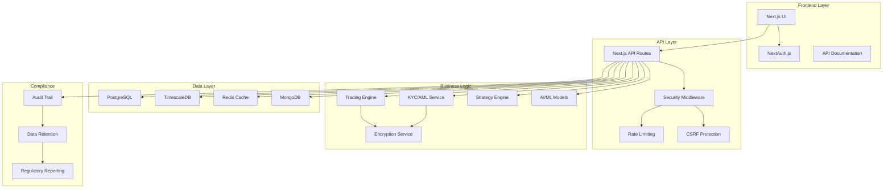

# 🏦 Stratford AI Wealth Engine

[](https://github.com/stratford-ai/wealth-engine/actions/workflows/ci.yml)
[](https://www.typescriptlang.org/)
[](https://nextjs.org/)
[](#security)
[](#compliance)

**Enterprise-Grade Financial Trading Platform** with comprehensive security, compliance, and AI-powered trading capabilities. Built for institutional clients with regulatory requirements and enterprise security standards.

## 🏗️ Architecture Overview



## 🚀 Quick Start

### Prerequisites
- Node.js 20+
- PostgreSQL 15+
- Redis 7+
- MongoDB 6+
- pnpm 8+

### Installation

```bash
# Clone the repository
git clone https://github.com/stratford-ai/wealth-engine.git
cd stratford_ai

# Install dependencies
pnpm install

# Setup environment variables
cp .env.example .env.local
# Edit .env.local with your configuration

# Initialize database
pnpm prisma migrate deploy
pnpm prisma db seed

# Start development server
pnpm dev
```

### Production Deployment

```bash
# Build for production
pnpm build

# Start production server
pnpm start

# Or using Docker
docker build -t stratford-ai .
docker run -p 3000:3000 stratford-ai
```

## 📁 Project Structure

```
stratford_ai/
├── 🔧 Configuration
│   ├── .github/workflows/          # CI/CD pipeline
│   ├── prisma/                     # Database schema & migrations
│   ├── docker-compose.yml          # Development environment
│   └── Dockerfile                  # Production container
│
├── 📦 Source Code
│   ├── src/
│   │   ├── 🎨 Frontend
│   │   │   ├── pages/              # Next.js pages
│   │   │   ├── components/         # React components
│   │   │   └── hooks/              # Custom React hooks
│   │   │
│   │   ├── 🔌 API Layer
│   │   │   ├── pages/api/          # API endpoints
│   │   │   ├── lib/auth/           # Authentication
│   │   │   └── lib/security/       # Security middleware
│   │   │
│   │   ├── 💼 Business Logic
│   │   │   ├── domain/             # Domain-driven design
│   │   │   ├── lib/trading/        # Trading engine
│   │   │   ├── lib/ml/             # AI/ML integration
│   │   │   └── lib/compliance/     # KYC/AML/compliance
│   │   │
│   │   ├── 🗄️ Data Layer
│   │   │   ├── lib/database/       # Database services
│   │   │   ├── generated/          # Prisma client
│   │   │   └── types/              # TypeScript definitions
│   │   │
│   │   └── 📋 Compliance & Docs
│   │       ├── lib/docs/           # API documentation
│   │       └── lib/monitoring/     # APM & observability
│   │
└── 📚 Documentation
    ├── docs/                       # Technical documentation
    ├── ARCHITECTURE.md             # System architecture
    ├── SECURITY.md                 # Security documentation
    └── COMPLIANCE.md               # Regulatory compliance
```

## ✨ Core Features

### 🔐 Enterprise Security
- **Authentication**: NextAuth.js with JWT, OAuth, and 2FA support
- **Authorization**: Role-based access control (USER, TRADER, ADMIN, COMPLIANCE)
- **Encryption**: AES-256-GCM field-level encryption for sensitive data
- **Rate Limiting**: Configurable rate limits with Redis sliding window
- **CSRF Protection**: Token-based CSRF protection for all state-changing operations
- **Security Headers**: Comprehensive security headers (HSTS, CSP, etc.)

### 📊 Trading & Analytics
- **Real-time Trading**: High-frequency trading engine with microsecond precision
- **Strategy Engine**: Pluggable trading strategies with backtesting framework
- **AI/ML Integration**: Machine learning models for price prediction and sentiment analysis
- **Portfolio Management**: Multi-asset portfolio tracking with risk management
- **Performance Analytics**: Comprehensive performance metrics and attribution analysis

### 🏛️ Regulatory Compliance
- **KYC/AML**: Automated Know Your Customer and Anti-Money Laundering workflows
- **Audit Trails**: Complete audit logging for all user actions and system events
- **Data Retention**: Automated data retention policies (SEC: 7 years, FINRA: 3-5 years)
- **Regulatory Reporting**: Automated SAR filing and regulatory report generation
- **GDPR Compliance**: Data portability, right to erasure, and privacy by design

### 🗄️ Multi-Database Architecture
- **PostgreSQL**: Transactional data (users, portfolios, trades)
- **TimescaleDB**: Time-series market data with automatic compression
- **Redis**: Caching, sessions, and real-time pub/sub
- **MongoDB**: Unstructured data (news, sentiment, documents)

## 🔒 Security

### Authentication & Authorization
```typescript
// Role-based access control example
import { withAuth } from '@/lib/auth/middleware'
import { requireRole } from '@/lib/auth/permissions'

export default withAuth(
  requireRole(['TRADER', 'ADMIN'])(async (req, res) => {
    // Only traders and admins can access this endpoint
  })
)
```

### Data Encryption
```typescript
// Field-level encryption for sensitive data
import { fieldEncryption } from '@/lib/security/encryption'

// Encrypt SSN before storage
const encryptedSSN = fieldEncryption.encryptSSN(ssn, userId)

// Decrypt when retrieving
const decryptedSSN = fieldEncryption.decryptSSN(encryptedSSN, userId)
```

### Rate Limiting
```typescript
// Configurable rate limiting
import { withRateLimit } from '@/lib/security/rate-limiter'

export default withRateLimit({
  maxRequests: 10,
  windowMs: 60000 // 10 requests per minute
})(handler)
```

## 🏛️ Compliance

### KYC/AML Workflow
```typescript
// Automated KYC verification
import { kycAMLService } from '@/lib/compliance/kyc-aml'

const kycRecord = await kycAMLService.submitKYC(userId, {
  fullName: 'John Doe',
  dateOfBirth: new Date('1990-01-01'),
  // ... other required fields
})

// Automatic AML screening
const amlAssessment = await kycAMLService.performAMLScreening(userId, kycData)
```

### Data Retention
```typescript
// Automated data retention policies
import { dataRetentionService } from '@/lib/compliance/data-retention'

// Initialize retention policies
await dataRetentionService.initializeRetentionPolicies()

// Start automated monitoring
dataRetentionService.startRetentionMonitoring()
```

## 🧪 Testing

### Running Tests
```bash
# Unit tests
pnpm test

# Integration tests
pnpm test:integration

# End-to-end tests
pnpm test:e2e

# Test coverage
pnpm test:coverage

# All tests
pnpm test:all
```

### Test Structure
```typescript
// Example test with proper setup
import { testDb } from '@/lib/testing/database'
import { createTestUser } from '@/lib/testing/factories'

describe('Trading Engine', () => {
  beforeEach(async () => {
    await testDb.reset()
  })

  it('should execute trade with proper validation', async () => {
    const user = await createTestUser()
    // Test implementation
  })
})
```

## 🚀 Deployment

### Environment Variables
```bash
# Database
DATABASE_URL="postgresql://..."
REDIS_URL="redis://..."
MONGODB_URL="mongodb://..."

# Authentication
NEXTAUTH_SECRET="your-secret-key"
NEXTAUTH_URL="https://your-domain.com"

# Encryption
ENCRYPTION_MASTER_KEY="32-character-encryption-key"

# External APIs
ALPHA_VANTAGE_API_KEY="your-api-key"
```

### CI/CD Pipeline
The project includes a comprehensive CI/CD pipeline with:
- **Security scanning** (Trivy, dependency audit)
- **Code quality** (ESLint, Prettier, TypeScript)
- **Testing** (unit, integration, e2e)
- **Compliance checks** (encryption validation, GDPR checks)
- **Automated deployment** (staging and production)

## 📚 API Documentation

Interactive API documentation is available at:
- **Development**: `http://localhost:3000/docs`
- **Production**: `https://app.stratford.ai/docs`

### Key Endpoints

| Endpoint | Method | Description | Auth Required |
|----------|--------|-------------|---------------|
| `/api/health` | GET | System health check | No |
| `/api/auth/register` | POST | User registration | No |
| `/api/auth/signin` | POST | User authentication | No |
| `/api/portfolios` | GET | List user portfolios | Yes |
| `/api/trades` | POST | Execute trade | Yes (TRADER+) |
| `/api/kyc/submit` | POST | Submit KYC application | Yes |
| `/api/compliance/export` | GET | Export user data (GDPR) | Yes |

## 🔧 Development

### Code Quality
```bash
# Linting
pnpm lint
pnpm lint:fix

# Type checking
pnpm type-check

# Code formatting
pnpm format
pnpm format:check

# All quality checks
pnpm verify
```

### Database Management
```bash
# Generate Prisma client
pnpm prisma generate

# Run migrations
pnpm prisma migrate dev

# Reset database
pnpm prisma migrate reset

# View database
pnpm prisma studio
```

## 📊 Monitoring & Observability

### APM Integration
- **Application Performance Monitoring** with DataDog/New Relic
- **Custom metrics** for trading performance
- **Error tracking** with Sentry
- **Real-time alerting** for system failures

### Health Checks
```bash
# Application health
curl https://app.stratford.ai/api/health

# Database connectivity
curl https://app.stratford.ai/api/health/database

# Service status
curl https://app.stratford.ai/api/health/services
```

## 🤝 Contributing

1. **Fork** the repository
2. **Create** a feature branch (`git checkout -b feature/amazing-feature`)
3. **Commit** changes (`git commit -m 'Add amazing feature'`)
4. **Push** to branch (`git push origin feature/amazing-feature`)
5. **Open** a Pull Request

### Code Standards
- Follow TypeScript strict mode
- Maintain >90% test coverage
- Use conventional commits
- Document all public APIs
- Follow security best practices

## 📄 License

This project is proprietary software. See [LICENSE](LICENSE) for details.

## 🆘 Support

- **Documentation**: [docs.stratford.ai](https://docs.stratford.ai)
- **API Reference**: [api.stratford.ai](https://api.stratford.ai)
- **Support**: [support@stratford.ai](mailto:support@stratford.ai)
- **Issues**: [GitHub Issues](https://github.com/stratford-ai/wealth-engine/issues)

---

**Built with enterprise security and regulatory compliance for institutional financial services.**